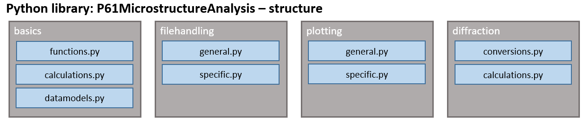
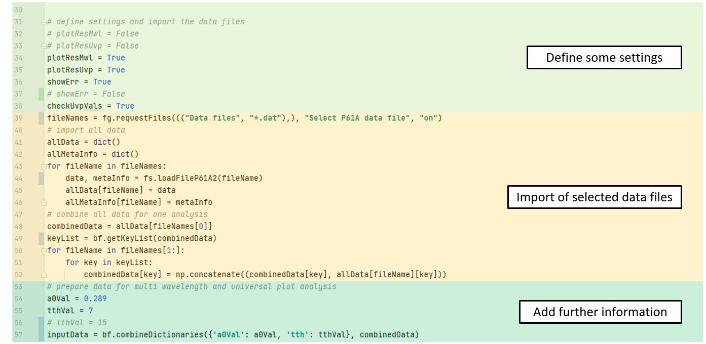
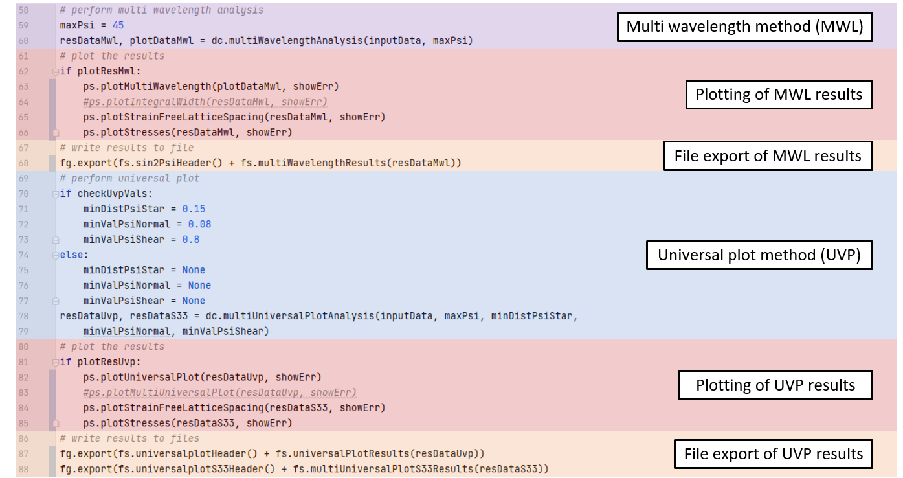
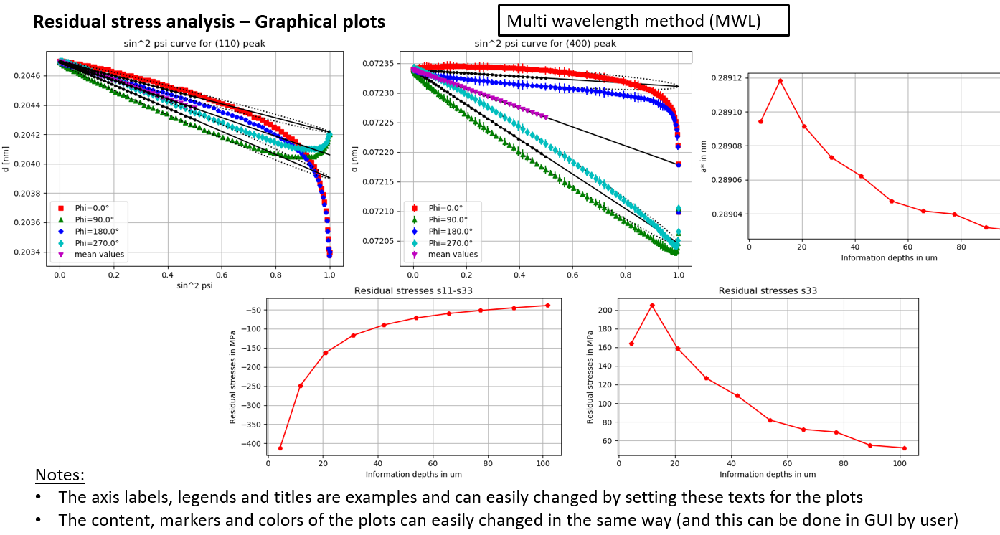

# P61MicrostructureAnalysis
This library provides diffraction specific calculations mainly for analyzing residual stresses of data 
measured at HZG beamline P61A at PETRA III, DESY located in Hamburg. 
This beamline uses two energy-dispersive detectors for diffraction analysis in the energy range up to 200 keV. 
It is intended to perform the preprocessing of measured data with the tool [P61Viewer](https://github.com/glebdovzhenko/P61Viewer), 
where result files can be exported and used for residual stress analysis by this library.

The structure of this project can be seen in the following drawing:

By this, basic features are:
* calculation and conversion of X-ray diffraction specific values (e. g. BRAGG angles in lattice spacings or calculation of orientation and stress factors)
* importing/exporting measured and analyzed data as well as plotting of measured or analyzed data
* basic analysis of diffraction spectra and containing phases or plotting pole figures out of texture data
* performing different residual stress analysis methods (like multi wavelength method, universal plot method etc.)
* calculation of stresses in real space (sample depth) of measured stresses in image space (integral depth)

A short overview of methods for residual stress analysis as the main part of this library is given by the next figure:

The provided functions are basically tested with simulated and reference data 
but an extensive test with measured data of the target facility is still ongoing. 
A detailed documentation will also follow soon. To get started, an example script 
is provided [here](https://github.com/SebastianProg/P61MicrostructureAnalysis/blob/main/src/TestDataHandlingP61A.py).

This script includes some examples for calculating and converting diffraction values.

Importing the preprocessed data of P61Viewer and prepare it for residual stress analysis.

Performing multi wavelength method (MWL) and universal plot method (UVP) with specified settings.

Currently available plots for multi wavelength method are shown now.

And for universal plot method there are also some plots.

For all analysis methods there are export functions available to also use the results outside of this library.

